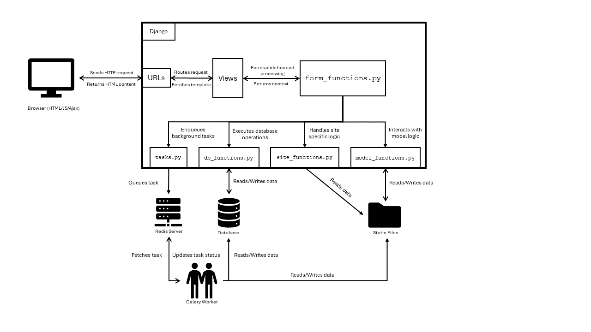
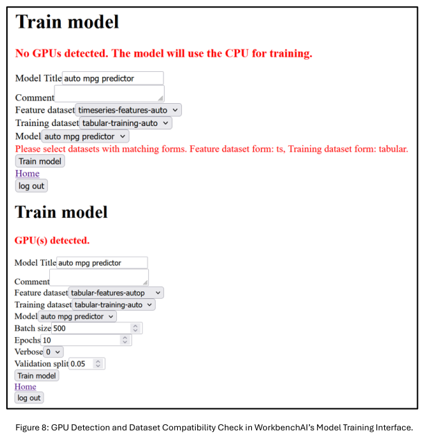

# WorkbenchAI - Django Web App

WorkbenchAI is a full-stack web application that allows users to build, train, and deploy neural networks in the browser—no coding required. Built with Django and TensorFlow/Keras, the app is modular, GPU-aware, and compatible with Windows and Linux.

Whether you’re experimenting with tabular data or building a model from scratch, WorkbenchAI helps you go from raw dataset to real predictions, all within a single app.

## Previews:

 - Illustrates the modular structure of the application—showing how site_functions, db_functions, and model_functions interact. Also outlines the communication between Django and the background worker for asynchronous tasks.


 - WorkbenchAI automatically detects NVIDIA GPUs and leverages the CUDA toolkit (if available) to accelerate model training for significantly improved performance. Additionally the platform can detect when incompatible datasets have been selected and prompt the user to select differently.


<div align="center">
  
</div>


## Table of Contents:
- [Technologies Used](#technologies-used)
- [Features](#features)
- [Installation](#installation)
- [Work Flow](#work-flow)
- [Project Structure](#project-structure)

- ## Technologies Used
- **Django**: Web framework for building the platform
- **Tensorflow/Keras**: Used for building and training neural networks
- **JavaScript/jQuery**: For dynamic form rendering and detecting client side interations
- **HTML**: For front-end development
- **SQLite**: Default database for development

## Features
- Account creation
- User authentication and authorization
- File upload
- Process datasets
- Build neural network models
- Train neural network models
- View model performance metrics
- Dynamic form rendering

## Installation
1. **Clone the repository**:
   ```bash
   git clone https://github.com/theo-jenkins/nn_sandbox.git
   cd your-repo-name
   ```

2. **Create a virtual environment and activate it**:
   ```bash
   # Windows:
   python -m venv mynnenv
   mynnenv\Scripts\activate
   # Linux:
   python3 -m venv mynnenv
   source mynnenv/bin/activate
   ```

3. **Install dependencies**:
   ```bash
   pip install -r requirements.txt
   ```

4. **Set up the database**:
   ```bash
   python manage.py migrate
   ```

5. **Run the development server**:
   ```bash
   python manage.py runserver
   ```

## (Optional) Start Background Workers
1. **Start Redis server**:
   ```bash
   redis-server
   ```

2. **Start Celery worker**:
   ```bash
   celery -A myproject worker --loglevel=info
   ```
3. **@shared_task decorator**:
  Ensure that the ```@shared_task``` decorator is used for all tasks in the *tasks.py* file. This will ensure that the tasks are executed in the background and do not block the main thread.
4. **.delay method**:
  The ```.delay()``` method is used to send a task to the Celery worker asynchronously. This method returns a ```AsyncResult``` object, which can be used to check the status of the task.

## Work Flow
- Instructions on how to use the application.
1. **Create an account** or **log in**
    - To access all the features, create and login in to your account.
2. **Upload a file** via the upload datasets form.
    - You can upload one or multiple files in *'.zip'* or *'.csv'* formats.
    - If needed, you can adjust the form validation rules such as ```validate_file_extensions``` and ```validation_file_size``` found in the *forms.py* to match your requirements.
4. **Create your dataset** via the process datasets form.
    - Select from your uploaded files to define the features included in the dataset.
    - Specify the dataset form ('tabular' or 'timeseries') and dataset type ('features' or 'targets').
    - Apply relevant feature engineering options to preprocess your features.
5. **Build your neural network model** via the build model form.
    - Choose the model type (currently supported: 'Sequential').
    - Define the architecture by specifying each layer’s nodes, layer type, and activation function.
    - Select the optimizer, loss function, and accuracy metrics for your model.
6. **Train your neural network model** via the train model form.
    - Select the features, targets, and model you wish to train.
    - Configure your training parameters ('batch size', 'epochs', 'verbose', 'validation split').
    - Start the training process.
7. **View and evaluate** your models performance metrics.
    - After training, review the model’s performance metrics, including accuracy, loss, and visualizations like training curves.
8. **Make predictions** using your trained model.
    - Select the model you wish to make predictions with.
    - Specify the input data for the prediction.
    - View the prediction results.
